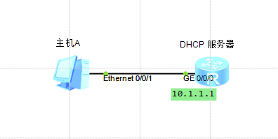
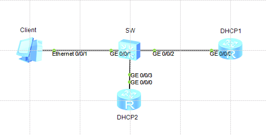

DHCP (Dynamic Host Configuration Protocol)

+  DHCP应用场景
+  基本原理
+  DHCP配置

####   DHPC原理与配置
>  客户端 服务端 工作模式
>  UDP 67(服务端) 68(客户端)
>  即插即用,管理方便
>  有效的使用IP资源
>  广播方式实现交互（DHCP本地网络），跨网段DHCP中继


####  DHCP报文类型
|报文类型|含义|备注|
|:-|:-|:-|
|DHCP DISCOVER | 客户端用来寻找DHCP服务器| |
|DHCP OFFER | DHCP服务器用来响应DHCP DISCOVER 报文，此报文携带了各种配置信息| |
|DHCP REQUEST | 客户端请求配置确认报文，或者续借租期||
|DHCP ACK | 服务器对REQUEST报文的确认响应| REQUEST和OFFER 相同时|
|DHCP NAK | 服务器对REQUEST 报文的拒绝响应| REQUEST和OFFER 不同时 |
|DHCP RELEASE | 客户端要释放地址时用来通知服务器|cmd --> ipconfig /release ,|
|DHCP DECLINE | 客户端拒绝使用 OFFER 的IP  | 客户端 arp 发现网络中已经有了OFFER的IP |
|DHCP INFORM | 客户端还需要一些其他信息||


ipconfig /release
ipconfig /renew
####  DHCP工作原理
####  DHCP 接口地址池配置
``` 
[Huawei]dhcp enable 
[Huawei]interface GigabitEthernet 0/0/0
[Huawei-GigabitEthernet0/0/0]ip addr 10.1.1.1 24
[Huawei-GigabitEthernet0/0/0]dhcp select interface 	
[Huawei-GigabitEthernet0/0/0]dhcp server dns-list 10.1.1.2 	
[Huawei-GigabitEthernet0/0/0]dhcp server excluded-ip-address 10.1.1.2 
[Huawei-GigabitEthernet0/0/0]dhcp server lease day 3 
[Huawei-GigabitEthernet0/0/0]quit 
[Huawei]display ip pool  
  -----------------------------------------------------------------------
  Pool-name      : GigabitEthernet0/0/0
  Pool-No        : 0
  Position       : Interface       Status           : Unlocked
  Gateway-0      : 10.1.1.1        
   Mask           : 255.255.255.0
   VPN instance   : --   
   IP address Statistic
    Total       :253   
    Used        :0          Idle        :252   
    Expired     :0          Conflict    :0          Disable   :1     
```
clear configuration interface GigabitEthernet 0/0/0

####   DHCP全局地址池配置

```
[R4]dhcp enable 
[R4]ip pool pool2
[R4-ip-pool-pool2]network 10.1.1.0 mask 24 
[R4-ip-pool-pool2]gateway-list  10.1.1.1 
[R4-ip-pool-pool2]lease day 10 
[R4-ip-pool-pool2]quit 
[R4]interface  GigabitEthernet 0/0/0
[R4-GigabitEthernet0/0/0]dhcp select global 
[R4-GigabitEthernet0/0/0]ip addr 10.1.1.1 24 
[R4-GigabitEthernet0/0/0]
[R4-GigabitEthernet0/0/0]display ip pool 
  Pool-name      : pool2
  Pool-No        : 0
  Position       : Local           Status           : Unlocked
  Gateway-0      : 10.1.1.1        
  Mask           : 255.255.255.0
  VPN instance   : --
  IP address Statistic
    Total       :253   
    Used        :1          Idle        :252   
    Expired     :0          Conflict    :0          Disable   :0 
```


#### DHCP中继



+ AR1(DHCP客户端)

  ```                         
  [AR1]dhcp enable 
  [AR1]interface GigabitEthernet 0/0/0	
  [AR1-GigabitEthernet0/0/0]ip add dhcp-alloc 
  ```

+ AR2(DHCP中继)

  ```  
  [Huawei]sysname  AR2
  [AR2]interface GigabitEthernet 0/0/0 
  [AR2-GigabitEthernet0/0/0]ip address 192.168.1.1 24 	
  [AR2-GigabitEthernet0/0/1]ip address 10.1.1.2 24 
  [AR2-GigabitEthernet0/0/1]quit
  [AR2]interface GigabitEthernet 0/0/0
  [AR2-GigabitEthernet0/0/0]dhcp select relay
  [AR2-GigabitEthernet0/0/0]dhcp relay server-ip 10.1.1.1 
  [AR2-GigabitEthernet0/0/0]quit 
  ```


+ AR3(DHCP服务器)

  ```   
  [Huawei]sysname  AR3 
  [AR3]dhcp enable 
  [AR3]ip  pool 1 	
  [AR3-ip-pool-1]network 192.168.1.0 mask 24 
  [AR3-ip-pool-1]gateway-list 192.168.1.1 
  [AR3-ip-pool-1]quit 	
  [AR3]interface GigabitEthernet 0/0/0
  [AR3-GigabitEthernet0/0/0]ip addr	
  [AR3-GigabitEthernet0/0/0]ip address 10.1.1.1 24  
  [AR3-GigabitEthernet0/0/0]dhcp select global
  [AR3]display ip routing-table
  [AR3]ip route-static 192.168.1.0 24 10.1.1.2 
  ```

#### DHCP  snooping



+ DHCP1

  ```
  [Huawei]sysname DHCP1
  [DHCP1]dhcp enable
  [DHCP1]ip pool 1 
  [DHCP1-ip-pool-1]network 10.1.1.0 mask 24 
  [DHCP1-ip-pool-1]gateway-list 10.1.1.1 	
  [DHCP1-ip-pool-1]dns-list 114.114.114.114 8.8.8.8 
  [DHCP1-ip-pool-1]lease day 1 
  [DHCP1-ip-pool-1]quit 	
  [DHCP1]interface GigabitEthernet 0/0/0 
  [DHCP1-GigabitEthernet0/0/0]ip address 10.1.1.1 24 	
  [DHCP1-GigabitEthernet0/0/0]dhcp select global 
  ```

+ DHCP2 

  ```
  [Huawei]sysname  DHCP2 
  [DHCP2]dhcp enable  
  [DHCP2]ip pool 2 	
  [DHCP2-ip-pool-2]network 192.168.1.0 mask 24	
  [DHCP2-ip-pool-2]gateway-list 192.168.1.1	
  [DHCP2-ip-pool-2]dns-list 10.200.43.151 114.114.114.114 
  [DHCP2-ip-pool-2]lease day 2  
  [DHCP2-ip-pool-2]quit 
  [DHCP2]interface GigabitEthernet 0/0/0 
  [DHCP2-GigabitEthernet0/0/0]ip address  192.168.1.1 24  
  [DHCP2-GigabitEthernet0/0/0]dhcp select global 
  ```


+ SW 

  ```
  [Huawei]sysname SW 
  [SW]dhcp enable 
  [SW]dhcp snooping enable 
  [SW]vlan 1 	
  [SW-vlan1]quit	
  [SW]interface GigabitEthernet 0/0/3 	
  [SW-GigabitEthernet0/0/3]dhcp snooping  trusted  
  ```


dhcp enable 
dhcp snooping enable 
vlan 1 
dhcp snooping enable 
dchp snooping trusted


地址池中的那些IP地址一帮会被保留
DHCP 接口 DNS 网关
DHCP 服务器的IP地址租期默认是多久？ 
1天

`<SW2>display port vlan active`

