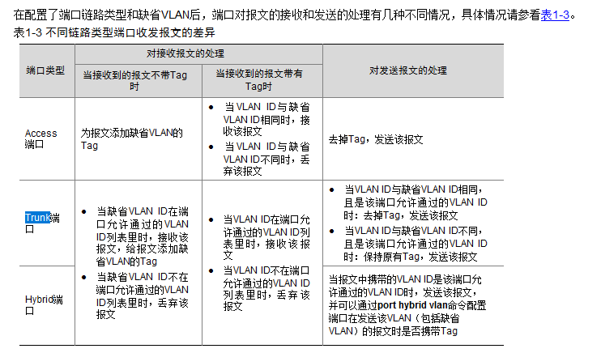

####  Vlan技术

隔离广播域

vlan 帧格式

802.1Q 数据帧携带tag



+  端口类型 Access 

  收：收到untag的数据帧，添加pvid 。收到tagged数据帧，和pvid比较相同接收，不同丢弃

  发：去掉tag，发送报文

  特地：只允许1个vlan通过

  ```
  [SW2]vlan batch  200
  [SW2]interface GigabitEthernet0/0/4
  [SW2-GigabitEthernet0/0/4]port link-type access	
  [SW2-GigabitEthernet0/0/4]port default vlan 200	
  [SW2-GigabitEthernet0/0/4]
  [SW2-GigabitEthernet0/0/4]display  vlan 
  The total number of vlans is : 3
  --------------------------------------------------------------------------------
  U: Up;         D: Down;         TG: Tagged;         UT: Untagged;
  MP: Vlan-mapping;               ST: Vlan-stacking;
  #: ProtocolTransparent-vlan;    *: Management-vlan;
  --------------------------------------------------------------------------------
  
  VID  Type    Ports                                                          
  --------------------------------------------------------------------------------
  1    common  UT:GE0/0/5(D)      GE0/0/6(D)      GE0/0/7(D)      GE0/0/8(D)      
                  GE0/0/9(D)      GE0/0/10(D)     GE0/0/11(D)     GE0/0/12(D)     
                  GE0/0/13(D)     GE0/0/14(D)     GE0/0/15(D)     GE0/0/16(D)     
                  GE0/0/17(D)     GE0/0/18(D)     GE0/0/19(D)     GE0/0/20(D)     
                  GE0/0/21(D)     GE0/0/22(D)     GE0/0/23(D)     GE0/0/24(D)     
                  Eth-Trunk1(U)                                                   
  
  100  common  
  200  common  UT:GE0/0/1(U)      GE0/0/4(D)   
  ```

  

+ 端口类型 Trunk

  收：收到untagged数据帧， 添加pvid值，pvid在允许通过列表接收报文，pvid不在允许通过列表丢弃报文。收到tagged数据帧，查看允许列表，在允许列表接收，不在列表中丢弃

  发：vlan id和pvid相同且是该端口允许通过vlan id，剥离tag 发送报文，vlan id 和pvid b不同，在允许通过的列表，保持原有的tag，发送报文  

  特地：允许多个vlan通过

  pvid : 发送时决定去tag

  ```
  [SW2]interface GigabitEthernet 0/0/5
  [SW2-GigabitEthernet0/0/5]port link-type  trunk
  [SW2-GigabitEthernet0/0/5]port trunk allow-pass vlan 200 
  [SW2-GigabitEthernet0/0/5]port trunk pvid vlan 200 
  [SW2-GigabitEthernet0/0/5]display vlan 
  The total number of vlans is : 3
  --------------------------------------------------------------------------------
  U: Up;         D: Down;         TG: Tagged;         UT: Untagged;
  MP: Vlan-mapping;               ST: Vlan-stacking;
  #: ProtocolTransparent-vlan;    *: Management-vlan;
  --------------------------------------------------------------------------------
  
  VID  Type    Ports                                                          
  --------------------------------------------------------------------------------
  1    common  UT:GE0/0/4(D)      GE0/0/6(D)      GE0/0/7(D)      GE0/0/8(D)      
                  GE0/0/9(D)      GE0/0/10(D)     GE0/0/11(D)     GE0/0/12(D)     
                  GE0/0/13(D)     GE0/0/14(D)     GE0/0/15(D)     GE0/0/16(D)     
                  GE0/0/17(D)     GE0/0/18(D)     GE0/0/19(D)     GE0/0/20(D)     
                  GE0/0/21(D)     GE0/0/22(D)     GE0/0/23(D)     GE0/0/24(D)     
                  Eth-Trunk1(U)                                                   
               TG:GE0/0/5(D)                                                      
  
  100  common  UT:GE0/0/1(U)                                                      
               TG:Eth-Trunk1(U)                                                   
  
  200  common  UT:GE0/0/5(D)
  
  
  ```

  


+ 端口类型 Hybrid

  收：收到untagged报文时，pvid在允许列表（tagged untagged列表）打上pvid 值。收到tagged报文时，vlan id 在允许通过列表是接收，不在通过列表是丢弃

  发：查看允许通过列表（tagged untagged)  ,tagged 列表保留tag, untagged 列表去掉tag

  ```
  [SW2]vlan batch 100 200 300 
  [SW2]interface GigabitEthernet 0/0/6	
  [SW2-GigabitEthernet0/0/6]port link-type hybrid  	
  [SW2-GigabitEthernet0/0/6]port hybrid tagged vlan 200 
  [SW2-GigabitEthernet0/0/6]port hybrid untagged vlan 300 	
  [SW2-GigabitEthernet0/0/6]port hybrid pvid vlan 100 
  [SW2-GigabitEthernet0/0/6]
  [SW2-GigabitEthernet0/0/6]display vlan 
  The total number of vlans is : 4
  --------------------------------------------------------------------------------
  U: Up;         D: Down;         TG: Tagged;         UT: Untagged;
  MP: Vlan-mapping;               ST: Vlan-stacking;
  #: ProtocolTransparent-vlan;    *: Management-vlan;
  --------------------------------------------------------------------------------
  
  VID  Type    Ports                                                          
  --------------------------------------------------------------------------------
  1    common  UT:GE0/0/5(D)      GE0/0/6(D)      GE0/0/7(D)      GE0/0/8(D)      
                  GE0/0/9(D)      GE0/0/10(D)     GE0/0/11(D)     GE0/0/12(D)     
                  GE0/0/13(D)     GE0/0/14(D)     GE0/0/15(D)     GE0/0/16(D)     
                  GE0/0/17(D)     GE0/0/18(D)     GE0/0/19(D)     GE0/0/20(D)     
                  GE0/0/21(D)     GE0/0/22(D)     GE0/0/23(D)     GE0/0/24(D)     
                  Eth-Trunk1(U)                                                   
  
  100  common  
  200  common  UT:GE0/0/1(U)      GE0/0/4(D)                                      
  
               TG:GE0/0/6(D)      Eth-Trunk1(U)                                   
  
  300  common  UT:GE0/0/6(D) 
  
  
  ```

  

  


